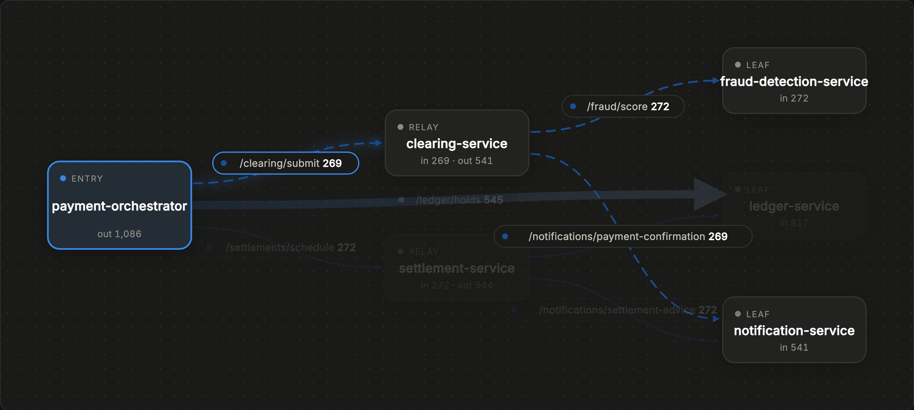

# Service map by URL



**An interactive service map in Grafana that shows, for any service and URL, every direct and transitive caller or callee, built purely from OpenTelemetry traces, logs and metrics.**

A local demo that shows, for a chosen service and URL, who calls it and what it calls, including transitive calls. Twelve Spring Boot 4.1 / Kotlin services (Java 25 LTS) send traces, logs and metrics via OTLP to a Grafana LGTM stack (`grafana/otel-lgtm`), and the dashboards draw the service map from those signals.

```
  ┌──────────────────────────── docker compose ─────────────────────────────┐
  │                                                                         │
  │   12 Spring Boot services            grafana/otel-lgtm                  │
  │   ┌───────────────────┐   OTLP      ┌──────────────────────────────┐    │
  │   │ api-gateway       │  :4318      │ OpenTelemetry Collector      │    │
  │   │ mobile-banking-bff│ ──────────> │   ├─> Tempo  (traces) ───┐   │    │
  │   │ payment-...       │ traces      │   ├─> Loki   (logs)      │   │    │
  │   │ ledger-service    │ logs        │   └─> Prometheus (metrics)   │    │
  │   │ ... (12 total)    │ metrics     │         ▲  service-graph     │   │    │
  │   │                   │             │         └─ metrics from Tempo┘   │    │
  │   └───────────────────┘             │ Grafana :3000                │    │
  │        ▲  call each other           │   ├─ Service map (HTML)      │    │
  │        └─ load: api-gateway         │   └─ Service map by URL      │    │
  │           (scheduled entrypoints)   └──────────────────────────────┘    │
  └─────────────────────────────────────────────────────────────────────────┘
```

Every outgoing call records the route of the request it was made from (`caller.uri`), so the dashboards can follow a call chain upstream and downstream, not just show direct neighbours.

## Services

The twelve **bank-like services** run from one generic image (`mesh-service`); each reads a YAML file in `mesh/` with its routes and the downstream calls each route makes.

| Service | Role | Serves | Calls |
|---|---|---|---|
| `api-gateway` | entry point, **load generator** | - | `mobile-banking-bff` `/api/transfers`, `/api/dashboard`; `identity-service` `/oauth/token` |
| `mobile-banking-bff` | backend for the mobile app | `/api/transfers`, `/api/dashboard` | `payment-orchestrator`, `customer-service`, `account-service`, `transaction-service` |
| `payment-orchestrator` | runs a payment end to end | `/payments` | `ledger-service` `/ledger/holds` (twice), `clearing-service`, `settlement-service` |
| `clearing-service` | clears a payment | `/clearing/submit` | `fraud-detection-service`, `notification-service` |
| `settlement-service` | schedules settlement | `/settlements/schedule` | `ledger-service` `/ledger/postings`, `notification-service` |
| `account-service` | account data | `/accounts/summary`, `/accounts/lookup` | `ledger-service` `/ledger/balances` |
| `transaction-service` | transaction history | `/transactions/search` | `account-service` `/accounts/lookup` |
| `customer-service` | customer profile | `/customers/profile` | `identity-service` `/identity/verify` |
| `identity-service` | login and token checks | `/identity/verify`, `/oauth/token` | - |
| `ledger-service` | double-entry ledger | `/ledger/holds`, `/ledger/postings`, `/ledger/balances` | - |
| `fraud-detection-service` | fraud scoring | `/fraud/score` | - |
| `notification-service` | customer notifications | `/notifications/payment-confirmation`, `/notifications/settlement-advice` | - |

Call graph of the bank mesh (arrows are calls, labels are the URL called):

```
                                  ┌─ /payments ─────> payment-orchestrator ─┬─ /ledger/holds (x2) ─────> ledger-service
                                  │                                         ├─ /clearing/submit ───────> clearing-service ─┬─ /fraud/score ─> fraud-detection-service
                                  │                                         │                                              └─ /notifications/payment-confirmation ─┐
                                  │                                         └─ /settlements/schedule ──> settlement-service ┬─ /ledger/postings ─> ledger-service  │
 api-gateway ─ /api/transfers ──> mobile-banking-bff ─┤                                                                      └─ /notifications/settlement-advice ──┤
      │                                               │                                                                                                             ▼
      │                                               └─ /customers/profile ─> customer-service ─ /identity/verify ─> identity-service          notification-service
      ├─ /api/dashboard ───────> mobile-banking-bff ─┬─ /accounts/summary ───> account-service ─ /ledger/balances ─> ledger-service
      │                                              └─ /transactions/search ─> transaction-service ─ /accounts/lookup ─> account-service
      └─ /oauth/token ─────────> identity-service
```

Change the topology by editing `mesh/*.yaml` and running `docker compose up -d`.

## Run it and see the UI

Requirements: Nix with flakes enabled, Docker with Compose (about 5 GB free RAM for the Docker VM) and internet access for the first build. Nothing else is installed on the machine: Nix provides JDK 25, the Gradle wrapper downloads Gradle, and the images are built with Spring Boot's `bootBuildImage` (Cloud Native Buildpacks, no Dockerfile).

One command builds all images, starts everything and then checks that it works: Grafana is healthy, both dashboards and the panel plugin are loaded, and the load generator is producing traces (api-gateway, down to the deepest service), service graph metrics and logs. It exits non-zero and names the failed check if something is missing:

```bash
nix run .
```

Stop and delete everything (including the stored telemetry) with:

```bash
nix run .#down
```

Docker only (no Nix, no JDK): a one-shot `image-builder` container runs the same Gradle build against your Docker socket, then the stack starts:

```bash
docker compose run --rm image-builder && docker compose up -d
```

For the Nix and manual variants, Docker must be reachable from Gradle; set `DOCKER_HOST` if your socket is not `/var/run/docker.sock` (e.g. Rancher Desktop). Without Nix and without the builder container, install a JDK 25 and run the two steps by hand:

```bash
./gradlew bootBuildImage   # builds the servicemap/mesh-service image
docker compose up -d
```

1. Wait about 2 minutes: the services start and the load generator waits 20-25 s before sending traffic. Check with `docker compose ps` (everything should be `Up`).
2. Open Grafana at http://localhost:3000. Anonymous access is enabled with the admin role, so there is no login.
3. Open one of the dashboards (Dashboards menu, or the direct links):
   - [Service map (HTML)](http://localhost:3000/d/servicemap-html/service-map-html): the main UI, drawn as SVG with labels on every edge.
   - [Service map by URL](http://localhost:3000/d/servicemap-endpoint/service-map-by-url): the same map in Grafana's Node Graph panel (edge text only on hover).
4. Pick the type (**Called service** or **Caller service**), a service and a URL. Good starting points:
   - Called service, `ledger-service`: everything that ends up calling the ledger.
   - Caller service, `api-gateway`: the complete call tree behind the gateway.
   - Called service, `fraud-detection-service`: the full chain behind a fraud check.
5. If a dropdown looks empty or the graph says "No calls found", wait another minute for traffic and pick a longer time range (top right).

Other UIs: Explore in Grafana has Tempo (traces), Loki (logs, label `service_name`) and Prometheus (metrics). Ports: Grafana 3000 and OTLP 4317/4318; the services are only reachable inside the compose network.

Without rebuilding, `docker compose down` and `docker compose up -d` stop and start the containers. All data lives inside the Grafana container and is lost when it is recreated.

## Load generator

There is no separate tool: some services call their downstreams on a schedule, which produces the traffic the map is built from.

| Source | What it does | Where to change it |
|---|---|---|
| `api-gateway` | every 3 s three `/api/transfers` calls, every 2 s four `/api/dashboard` calls, every 5 s one `/oauth/token` call, each fanning out through the mesh | `entrypoints` in `mesh/api-gateway.yaml` (`every-millis`, `times`) |

Useful commands:

```bash
docker compose up -d api-gateway            # apply a changed mesh/api-gateway.yaml
docker compose stop api-gateway             # pause the load; the map empties after the selected time range
docker compose start api-gateway            # resume it
```

The thickness of an edge in the dashboards follows the call counts, so changing `times` or `every-millis` changes how thick the edges look.

## Service map by URL (direct and transitive callers)

Open the dashboard [Service map by URL](http://localhost:3000/d/servicemap-endpoint/service-map-by-endpoint). Pick the type first (**Selected service is the** `Called service` or `Caller service`), then the service and URL:

- `Called service`: shows everything upstream that calls the selected service/URL.
- `Caller service`: shows everything downstream the selected service calls (e.g. `api-gateway` → `mobile-banking-bff` → `payment-orchestrator` → ...). URL filters by the outgoing call: the URL being called on the downstream service.

- `ledger-service` + `/ledger/holds` → `api-gateway → mobile-banking-bff → payment-orchestrator → ledger-service`
- `ledger-service` + all URLs → every path that ends at the ledger, with the thick edges showing the busiest routes
- Edge thickness is normalized across the visible edges (thinnest = least calls, thickest = most calls); every edge has a small label node in the middle showing caller, URL and call count (Grafana Node Graph cannot draw text directly on edges).

How it works: each outgoing call records the inbound route of its caller as span attribute `caller.uri` (`common/.../CallerUriObservationFilter.kt`). Tempo's service-graph generator turns `uri` and `caller.uri` into metric labels (`lgtm/tempo-config.yaml`), so an edge `d → c /hello` knows it was made while serving `d /config`. The dashboard follows those links upstream with PromQL.

## HTML dashboard (edge labels, animated edges)

*Selecting an edge (see the picture at the top) highlights and animates it and its call chain, fades everything else, names it in the "Selected" bar and filters the table below to the edges in that chain.*

A selection can be shared as a link: add `&select=edge:<caller>|<called>|<url>` or `&select=service:<name>` to the dashboard URL (and `&view=map` to hide everything but the map), e.g. `...service-map-html?var-mode=0&var-service=payment-orchestrator&select=edge:payment-orchestrator|clearing-service|/clearing/submit`.

[Service map (HTML)](http://localhost:3000/d/servicemap-html/service-map-html) is the same map drawn as SVG by the Business Text panel (`marcusolsson-dynamictext-panel` 6.3.0, Handlebars templates, Apache-2.0, maintained by Grafana Labs). It uses the same dropdowns and adds:

- summary cards (selection, services, calls, busiest edge, reach) and a hop filter (`Direct only`, `Up to N hops`)
- every edge labelled with its URL and call count, ported to its own spot on the service card so labels do not overlap
- thickness and a single-hue blue gradient scaled across the visible edges
- service cards with in/out call totals; the selected service is highlighted
- hover an edge to trace its call chain with a detail tooltip; hover or focus a service to isolate its calls (after a short delay so brushing across the map stays calm)
- click a service or an edge to select it: it stays highlighted, a "Selected" bar names it, and the table below shows only the matching edges (a service's edges, or an edge's call chain with the selected row marked); `Esc` or `Clear` releases it
- Grafana light/dark theme, reduced-motion support, and a table view underneath

- The plugin zip is committed unpacked in `grafana/plugins/` and mounted into the container, because the container cannot download plugins behind a TLS-intercepting proxy. To update it: download the new version from https://grafana.com/grafana/plugins/marcusolsson-dynamictext-panel/ and unpack it there.
- `GF_PANELS_DISABLE_SANITIZE_HTML=true` in `docker-compose.yaml` lets the panel render SVG.
- Dashboard source: `grafana/html-dashboard/` (`content.hbs`, `helpers.js`, `afterRender.js`, `styles.css`). Regenerate the JSON with `python3 grafana/html-dashboard/build.py`, then `docker compose restart lgtm`.

## Where the signals are

- Traces: Explore → Tempo
- Logs (with trace ids): Explore → Loki, label `service_name`
- Metrics: Explore → Prometheus (`http_server_requests_milliseconds_count`, JVM metrics)

## Tests

```bash
nix develop -c ./gradlew test
```

The Gradle build (`build.gradle.kts`, one module per service plus `common`) compiles Kotlin to JVM 25 bytecode and runs the images on a Java 25 JRE chosen by the buildpack (`BP_JVM_VERSION` in each `build.gradle.kts`). After changing code, rebuild with `./gradlew bootBuildImage` and run `docker compose up -d` again.
